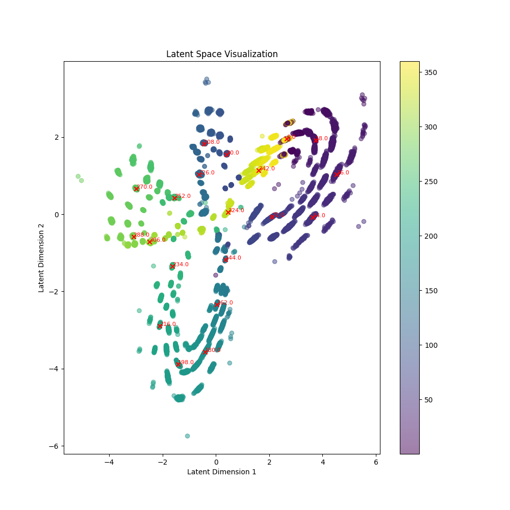

# Seismic-Angle-Recognition

<a target="_blank" href="https://cookiecutter-data-science.drivendata.org/">
    
</a>

## Abstract

This project presents a novel approach to predicting the arrival angle of seismic signals relative to a reference station using a neural network. The methodology involves encoding the input signals into a compact latent space representation using a Variational Autoencoder (VAE) and subsequently mapping these embeddings to the target angles using a neural network trained with triplet loss and contrastive loss. This approach leverages the power of convolutional neural networks (CNNs) for feature extraction and the effectiveness of metric learning techniques for robust angle prediction.

## Introduction

Seismic signal analysis is crucial for understanding the Earth's subsurface structures and for monitoring seismic activities. Traditional methods often rely on manual feature extraction and heuristic-based models, which can be time-consuming and less accurate. In this project, we propose an automated and data-driven approach using deep learning techniques to predict the arrival angle of seismic signals.

## Methodology

### Variational Autoencoder (VAE)

The VAE is employed to encode the 3D seismic signals into a lower-dimensional latent space. The VAE consists of an encoder and a decoder network. The encoder compresses the input signals into a latent space, capturing the essential features of the data. The decoder reconstructs the signals from the latent space representation. The VAE is trained to minimize the reconstruction loss and the Kullback-Leibler (KL) divergence loss.

#### Encoder

The encoder network is a convolutional neural network (CNN) that processes the input signals and outputs the mean and log variance of the latent space distribution. The encoder layers are designed to capture hierarchical features from the input signals.

#### Decoder

The decoder network is a transposed convolutional neural network that reconstructs the input signals from the latent space representation. The decoder layers are designed to upsample the latent space representation back to the original signal dimensions.

#### Reparameterization Trick

To enable backpropagation through the stochastic latent variables, the reparameterization trick is used. This involves sampling from a standard normal distribution and scaling it by the mean and log variance obtained from the encoder.

### Triplet Loss

To ensure that the latent space representation is meaningful and discriminative, we employ triplet loss during training. Triplet loss encourages the embeddings of similar signals to be closer together and the embeddings of dissimilar signals to be farther apart. This is achieved by forming triplets of anchor, positive, and negative samples and minimizing the distance between the anchor and positive samples while maximizing the distance between the anchor and negative samples.

### Contrastive Loss

In addition to triplet loss, we use contrastive loss to further refine the embeddings. Contrastive loss penalizes large differences in predictions for similar targets and enforces a minimum difference in predictions for dissimilar targets. This helps in creating a more robust and discriminative latent space representation.

## Implementation

The implementation is organized into several modules:

- [`vae_model.py`](seismic_angle_recognition/vae_model.py): Defines the VAE architecture, including the encoder, decoder, and reparameterization trick.
- [`train_model.py`](seismic_angle_recognition/train_model.py): Contains the training loop for the VAE and the embedding-to-label model, including the implementation of triplet loss and contrastive loss.
- [`data_module.py`](seismic_angle_recognition/data_module.py): Handles data loading, preprocessing, and splitting into training, validation, and test sets.
- [`config.yaml`](seismic_angle_recognition/config/config.yaml): Configuration file containing hyperparameters for the models and training process.

## Results

The proposed approach demonstrates significant improvements in predicting the arrival angle of seismic signals. The use of VAE for encoding the signals into a compact latent space, combined with triplet loss and contrastive loss for training the embedding-to-label model, results in accurate and robust angle predictions.

Here is a ordered latent space of the Variational AutoEncoder.



Some metrics are available here.

## Conclusion

This project presents a novel and effective approach to seismic signal analysis using deep learning techniques. The combination of VAE, triplet loss, and contrastive loss provides a powerful framework for predicting the arrival angle of seismic signals. Future work can explore the extension of this approach to 3D angle reconstruction.

## Project Organization

```
├── LICENSE            <- Open-source license
├── Makefile           <- Makefile with convenience commands like `make data` or `make train`
├── README.md          <- The top-level README for developers using this project.
├── data
│   └── signals_name   <- Signals data
│
├── docs               <- A default mkdocs project; see www.mkdocs.org for details
│
├── models             <- Trained and serialized models, model predictions, or model summaries
│
├── notebooks          <- Jupyter notebooks. Naming convention is a number (for ordering),
│                         the creator's initials, and a short `-` delimited description, e.g.
│                         `1.0-jqp-initial-data-exploration`.
│
├── pyproject.toml     <- Project configuration file with package metadata for 
│                         seismic_angle_recognition and configuration for tools like black
│
├── references         <- Data dictionaries, manuals, and all other explanatory materials.
│
├── reports            <- Generated analysis as HTML, PDF, LaTeX, etc.
│   └── figures        <- Generated graphics and figures to be used in reporting
│
├── requirements.txt   <- The requirements file for reproducing the analysis environment, e.g.
│                         generated with `pip freeze > requirements.txt`
│
├── setup.cfg          <- Configuration file for flake8
│
└── seismic_angle_recognition   <- Source code for use in this project.
    │
    ├── __init__.py             <- Makes seismic_angle_recognition a Python module
    │
    ├── config.py               <- Store useful variables and configuration
    │
    ├── dataset.py              <- Scripts to download or generate data
    │
    ├── features.py             <- Code to create features for modeling
    │
    ├── modeling                
    │   ├── __init__.py 
    │   ├── predict.py          <- Code to run model inference with trained models          
    │   └── train.py            <- Code to train models
    │
    └── plots.py                <- Code to create visualizations
```

--------

